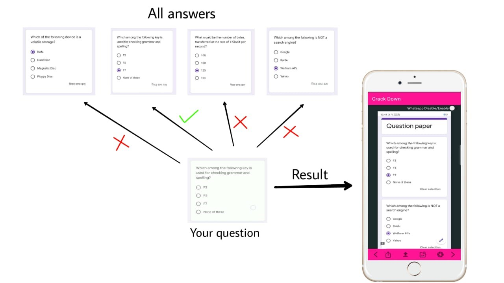
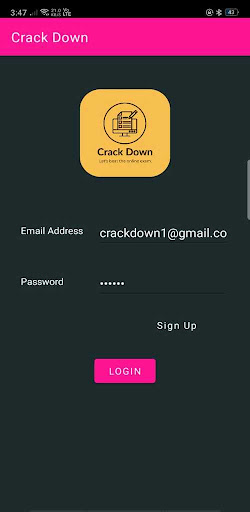
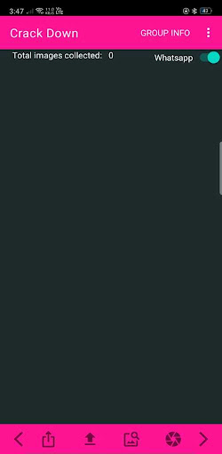

# CrackDown

### What is CrackDown?

CrackDown is mobile application platform. It can be used to share your answers
with your friends during your online exam.

### How it works?

Traditionally you share your answers on WhatsApp or similar platform. But if
your group has big number of images then it will be very difficult and
time-consuming process to find your questions answer among all the collected
images on group.

Now, here comes CrackDown, it will match your question with all the images you
have and will give matching answers among all images within a second!

### Some tips to increase efficiency of CrackDown.

1.  If you are using WhatsApp/Telegram to share your answer images, then
    **Enable Auto Download** feature so that you do not need to download images
    each time. Images will be downloaded automatically in background.

2.  While searching your question using Camera try to capture image of only
    question, do not capture whole screen.

3.  Use CrackDown Group instead of WhatsApp to know who is sender of the answer
    so that you can decide how much you should trust on that answer.
    
### Screenshots

-   **YouTube links for further reference:**

    1.  Introduction to CrackDown: <https://youtu.be/L0OX4Yg_baQ>

    2.  CrackDown Demo: <https://youtu.be/_qpdYuFu1lc>
 
## CrackDown User Manual:
[Documentation](https://github.com/suraj2439/CrackDown/blob/master/Documents/CrackDown%20User%20Manual.pdf)
    
## Download

